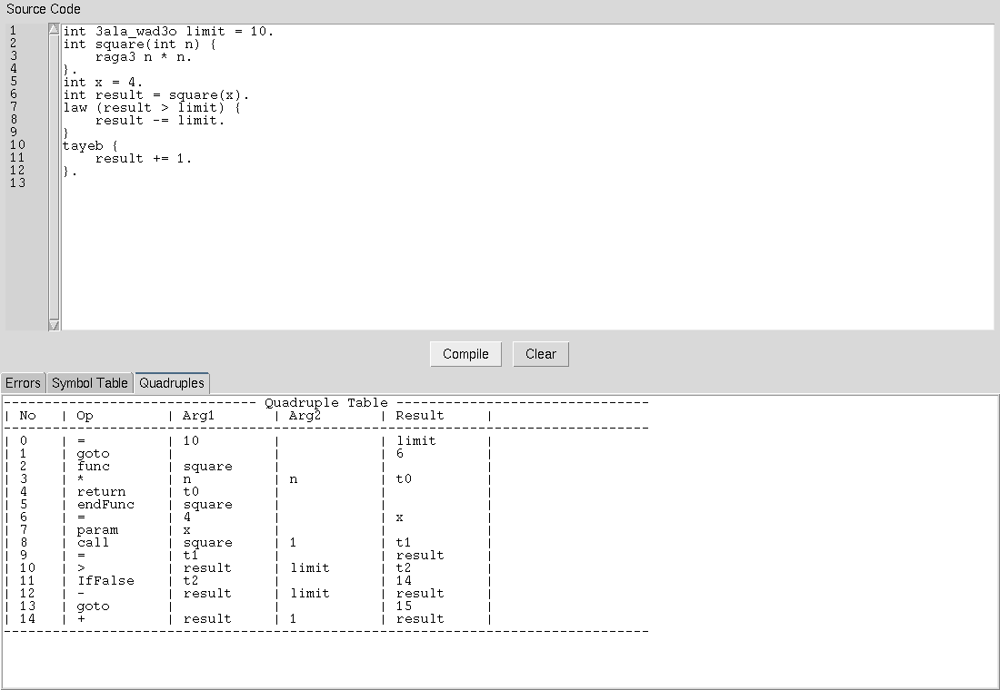

# Simple Programming Language Compiler

A custom compiler front-end built using Lex and Yacc (Flex/Bison) that translates a unique programming language into intermediate quadruples. 

## Project Overview
This project implements the front-end of a compiler for a custom language, covering lexical, syntax, and semantic analysis. The language supports:
- **Data Types**: int, float, bool, string, and void. 
- **Structures**: Variable/constant declarations, arithmetic/logical expressions, if-else, while, for, repeat-until, and switch-case statements. 
- **Functions**: Parameterized functions and recursion.

## Language Symbols (Tokens)
The lexer recognizes the following custom keywords and symbols: 

| Category | Tokens / Keywords | Description |
| :--- | :--- | :--- |
| **Data Types** | `int`, `float`, `bool`, `string`, `wala_haga` (void) | Standard types and custom void. |
| **Conditionals** | `law` (if), `tayeb` (else), `switch` / `case` / `default` | Conditional flow. |
| **Loops** | `karar ... to` (for), `tol_ma` (while), `e3mel { } lehad` (repeat-until) | Iterative constructs. |
| **Logical** | `and`, `or`, `not` | Boolean logic. |
| **Constants** | `3ala_wad3o` (written after the type: `int 3ala_wad3o x = 5.`) | Constant declaration. |
| **Returns** | `raga3` | Function return. |

Every statement, including a closing `}` of a block, ends with a `.`.

## Intermediate Representation (Quadruples)
The compiler generates quadruples in the format: `(Operator, Operand 1, Operand 2, Result)`.

| Operator | Function | Description |
| :--- | :--- | :--- |
| `+`, `-`, `*`, `/` | Arithmetic | Standard math operations. |
| `==`, `!=`, `>`, `<` | Comparison | Logical comparison instructions. |
| `IfTrue`, `IfFalse` | Control Flow | Conditional jumps based on satisfied conditions. |
| `goto` | Control Flow | Unconditional jump to a label. |
| `func`, `endFunc`, `param`, `call`, `return` | Functions | Function declaration, arguments, calls and returns. |

## GUI Components
- **Error Log**: Real-time syntax and semantic error reporting. 
- **Symbol Table**: Visualization of identifiers, types, and scopes. 
- **Quadruples**: View of the generated intermediate code. 



## Build & Run

Requires `flex`, `bison` and `gcc` (plus Python 3 with Tkinter for the GUI).

```bash
make                                 # builds ./compiler
./compiler examples/sample.txt       # prints the symbol table and quadruples
python3 gui.py                       # editor with Errors / Symbol Table / Quadruples tabs
```

## Example

`examples/sample.txt`:

```text
int 3ala_wad3o limit = 10.
int square(int n) {
    raga3 n * n.
}.
int x = 4.
int result = square(x).
law (result > limit) {
    result -= limit.
}
tayeb {
    result += 1.
}.
```

Generated quadruples:

```text
| No   | Op         | Arg1       | Arg2       | Result     |
| 0    | =          | 10         |            | limit      |
| 1    | goto       |            |            | 6          |
| 2    | func       | square     |            |            |
| 3    | *          | n          | n          | t0         |
| 4    | return     | t0         |            |            |
| 5    | endFunc    | square     |            |            |
| 6    | =          | 4          |            | x          |
| 7    | param      | x          |            |            |
| 8    | call       | square     | 1          | t1         |
| 9    | =          | t1         |            | result     |
| 10   | >          | result     | limit      | t2         |
| 11   | IfFalse    | t2         |            | 14         |
| 12   | -          | result     | limit      | result     |
| 13   | goto       |            |            | 15         |
| 14   | +          | result     | 1          | result     |
```

The symbol table lists each scope (global, function, and each block) with every identifier's kind (`VAR`, `CONST`, `FUNC`), type, and whether it was initialized and used.
